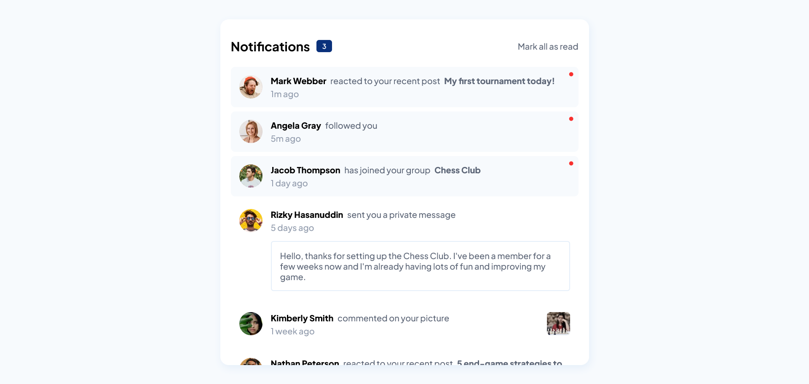

# Notifications page solution

This is a solution to the [Notifications page challenge on Frontend Mentor](https://www.frontendmentor.io/challenges/notifications-page-DqK5QAmKbC).

## Table of contents

- [Overview](#overview)
  - [The challenge](#the-challenge)
  - [Screenshot](#screenshot)
  - [Links](#links)
- [My process](#my-process)
  - [Built with](#built-with)
  - [What I learned](#what-i-learned)
  - [Useful resources](#useful-resources)
- [Author](#author)

## Overview

### The challenge

Users should be able to:

- Distinguish between "unread" and "read" notifications
- Select "Mark all as read" to toggle the visual state of the unread notifications and set the number of unread messages to zero
- View the optimal layout for the interface depending on their device's screen size
- See hover and focus states for all interactive elements on the page

### Screenshot

### Links

- You can take a look [here](https://darrowv.github.io/notification-page-main)

## My process

### Built with

- JavaScript
- Semantic HTML5 markup
- CSS custom properties
- Flexbox
- CSS Grid

### What I learned

### Useful resources

- [Example resource 1](https://www.example.com) - This helped me for XYZ reason. I really liked this pattern and will use it going forward.
- [Example resource 2](https://www.example.com) - This is an amazing article which helped me finally understand XYZ. I'd recommend it to anyone still learning this concept.

## Author

- Github - [@darrowv](https://github.com/darrowv)
- Frontend Mentor - [@darrowv](https://www.frontendmentor.io/profile/darrowv)
- LinkedIn - [Nasyr Akhmadov](https://linkedin.com/in/darrowv)
- Telegram - [Muhammad Nasyr](t.me/m_nasyr)